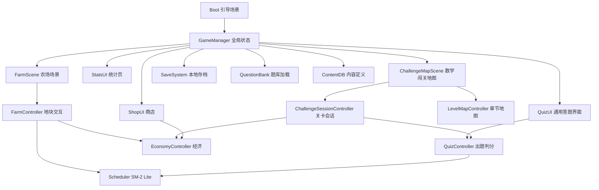

# 学田 (Study Farm) 技术设计

Feature Name: study-farm
Updated: 2026-09-14 (rev5: 补完 T5 核心系统 + 编译验证 + 题库 camelCase 管线 + schema v3)
需求文档: 同目录 requirements.md

## Description

Unity C# 开发的 2D 像素风农场学习游戏，Android APK 交付，纯离线单机。双玩法支柱：

- **知识农场**：环工原理/环工学知识点 → 播种 → 答题浇水 → SM-2 Lite 间隔复习 → 收获。
- **数学闯关**：750 题按章节组织为关卡地图，折叠答案交互，星级结算，奖励反哺农场经济。

全部知识点与题目携带出处（书名/章节/页码/题号）。美术由 AI 并行生成（80+ 资产，tools/art-manifest.json）。

## 技术选型与理由

| 项 | 选择 | 理由 |
|---|---|---|
| 引擎 | Unity 6000.x LTS | 用户指定；Android 导出成熟；C# 生态 |
| 脚本 | C# + Newtonsoft JSON | 题库/存档序列化，schema 灵活 |
| 渲染 | URP 2D | 像素风标准管线 |
| 分辨率 | 竖屏 1080×1920 逻辑分辨率，Canvas Scaler 适配 | 单手答题体验 |
| minSdk / 目标 | 24 (Android 7.0) / ARM64 + IL2CPP | 覆盖 95%+ 设备 |
| 题库转换脚本 | Node.js（tools/ 下） | 容器内跑通全流程 |
| 生图管线 | tools/gen-art.mjs 并行生成，manifest 驱动 | 已验证，见"美术管线"节 |

## Architecture



- **QuizController**：农场与闯关共用的答题核心。负责抽题、判分、答案展开状态机（折叠/自动展开/主动展开）、错题记录、连击判定。农场模式输出 ReviewResult，闯关模式输出 ChallengeAnswer。
- **ChallengeSessionController**：一关的会话状态（题目序列、逐题结果、退出即作废）。
- **LevelMapController**：章节地图渲染（节点/星级/boss 锁定态）、进入关卡路由。
- **FarmController / Scheduler / EconomyController / SaveSystem / QuestionBank / ContentDB**：同 rev1 职责。

### 答案折叠状态机（QuizController 内）

```
[state] SHOWING_QUESTION
  ├─ 玩家点"展开答案" → MANUAL_REVEALED（该题标记判负）→ 玩家可继续作答或跳过
  ├─ 玩家提交作答 → JUDGED（自动展开答案+解析+出处）→ 下一题
MANUAL_REVEALED
  ├─ 玩家提交作答 → 判定仍执行，但该题强制记 wrong（防作弊）
JUDGED
  ├─ 点"下一题" → 下一题或结算
```

## Components and Interfaces

```csharp
// 核心接口（v1 草案）
interface IScheduler {
    ReviewPlan OnAnswer(string kpId, bool correct);
    List<string> GetDueKnowledgePoints();
}

interface IQuestionBank {
    Question DrawQuestion(string kpId);                 // 农场抽题（排除近5次已用）
    Question GetQuestion(string id);                    // 闯关按 ID 取题
    List<Level> GetLevels(string chapterId);
    KnowledgePointMeta GetMeta(string kpId);            // 含 source
}

interface IChallengeSession {
    void Start(Level level);
    ChallengeAnswer Submit(Question q, int? choice);    // choice=null 表示跳过
    LevelResult Finish();                               // 星级结算
    void Abort();                                       // 退出，整关作废
}

interface ISaveSystem {
    void Save(GameSave state);
    GameSave Load();
    string Export();
    bool Import(string path);
}
```

## Data Models

### 题库 JSON（StreamingAssets/questionbank/{subject}.json）

```json
{
  "subject": "math",
  "subject_name": "高等数学",
  "version": 1,
  "source_book": "高等数学下册精选750题",
  "chapters": [
    {
      "id": "math.ch07",
      "name": "第七章 微分方程",
      "levels": [
        { "id": "math.ch07.lv01", "name": "第1关", "question_ids": ["math.q0061"],
          "pass_rate": 0.5, "star3_rate": 0.9, "star2_rate": 0.7, "is_boss": false,
          "first_clear_reward": { "fruit": 30, "seeds": 2 } }
      ],
      "knowledge_points": [
        {
          "id": "math.ch07.kp01",
          "name": "一阶线性微分方程",
          "summary": "通解公式：y = e^(-∫P dx) ( ∫Q e^(∫P dx) dx + C )",
          "crop_rarity": "rare",
          "source": { "book": "高等数学下册精选750题", "chapter": "第七章", "page": "P118-126" }
        }
      ]
    }
  ],
  "questions": [
    {
      "id": "math.q0001",
      "kp_id": "math.ch07.kp01",
      "type": "single",
      "stem": "...",
      "options": ["A...", "B...", "C...", "D..."],
      "answer": 2,
      "explanation": "...",
      "difficulty": 2,
      "source": { "book": "高等数学下册精选750题", "page": "P123", "no": 15 },
      "answerSource": { "book": "高等数学下册精选750题", "page": "P312", "no": 15 },
      "needsReview": false
    }
  ]
}
```

- 键名约定：**camelCase**（与 C# 模型属性名一致，Unity JsonUtility 按属性名匹配，snake_case 会导致字段全空——2026-09-14 修复，见 T7）。
- `source`：题面出处；`answerSource`：书后答案页出处（750 题答案在书后，需匹配）。
- 环工知识点 source 用教材页码/小节；summary 卡片（播种卡/复习卡）必须渲染出处。
- type 枚举：single / multi / judge / blank / calc / proof。difficulty 1-3。
  calc/blank/proof 为文本题，v1 无机器判分，答题界面走「对照折叠答案自评」模式。

### 存档 JSON（persistentDataPath/save.json）

schema_version 3（2026-09-14 升级，从 v2 自动迁移）：

```json
{
  "schemaVersion": 3,
  "crops": [ { "kpId": "env.kp001", "growth": 3, "interval": 3, "ease": 2.3, "nextDue": 1750000000, "state": "growing" } ],
  "inventory": { "seed_common": 5, "fertilizer": 2, "potion": 0, "rare_seed": 1 },
  "fruit": 120,
  "streak": { "current": 7, "best": 12, "lastActiveDate": "2026-09-13",
              "rescueMonth": "2026-09", "zeroedAtUnix": 0, "preZeroStreak": 0 },
  "levels": { "math.ch08.lv01": { "stars": 3, "bestRate": 0.95, "cleared": true } },
  "chapterChests": ["math.ch08"],
  "revealLog": { "math.q0001": { "count": 2, "last": "2026-09-13" } },
  "mastered": [ "env.kp001" ],
  "recentDraws": { "env.kp001": [ "env.q0001" ] },
  "envAnswers": 40, "envCorrect": 33,
  "chapterStats": { "math.ch08": { "total": 20, "correct": 17 } },
  "dailyAnswers": { "2026-09-13": 9 },
  "lastLegendaryDropUnix": 0
}
```

## SM-2 Lite 算法（不变）

```
答对: interval = interval == 0 ? 1 : interval == 1 ? 3 : round(interval * ease)
      ease 初始 2.2，答对 +0.05（上限 2.8），答错重置 ease=2.2
答错: interval = 1, growth 不变（不倒退，防挫败）
作物上限: growth == 5 → 可收获
蔫萎: next_due 超时 24h → state=withered（化肥立即恢复并刷新 next_due）
```

## 题库转换管线（tools/，Node.js）

1. `tools/pdf-extract.mjs`：PDF → 章节结构文本（750 题按题目编号切分；两本环工教材按目录章节切分）。
2. `tools/build-questionbank.mjs`：
   - 数学：题目文本 → 题目 JSON；**答案匹配步骤**——书后答案区按题号对齐到题面，写入 answer/explanation/answer_source；匹配失败的题标记 needs_review 且默认不进关卡。
   - 环工：教材章节 → 知识点摘要（含出处页码）+ 概念辨析单选/判断题。
3. `tools/validate-questionbank.mjs`：强制校验——ID 唯一、kp_id 引用完整、答案索引合法、**source/answer_source 非空**、关卡 question_ids 引用完整、needs_review 题不入关卡。任何失败阻断构建。
4. 产出物提交到 `game/Assets/StreamingAssets/questionbank/`。
5. 质量关卡：转换后人工抽查每科 ≥20 题（含答案匹配正确性抽检）。

## APK 构建管线（容器内自动，Unity 后续启动）

1. 容器安装 Unity 6000.x LTS Linux 编辑器 + Android Build Support（含 JDK/SDK/NDK 模块）。
2. 授权：用户提供 Unity 账号 → CLI 激活个人版；失败走手动激活文件流程（脚本输出指引）。
3. `game/build.sh`：`unity-editor -batchmode -nographics -quit -executeMethod BuildScript.BuildAndroid` → `build/StudyFarm-{version}-arm64.apk`。
4. 构建前置钩子：自动运行 validate-questionbank.mjs，失败即终止。
5. 风险预案：容器构建失败 → 降级为用户本地构建（交付工程 + 文档）。

## 美术管线（已运行）

1. **生成**：`tools/gen-art.mjs --manifest tools/art-manifest.json --concurrency 4`，OpenAI 兼容端点（agnes-image-2.5-flash），manifest 80 项资产，style_suffix 统一风格（32×32 像素风/限定调色板/星露谷味/纯白底/无文字）。
2. **资产分类**：crops（环工 9 种作物×3 阶段 + 数学奖杯株×2）、ui 图标×18、tiles×6、buildings×12、quiz 特效×6、challenge 节点徽章×6、character×2。
3. **后处理（待做）** `tools/post-art.mjs`：纯白底抠透明（白键色容差）、降采样至 256px、紧凑裁剪。
4. **角色动画**：AI 生图只出立绘（front/back）；四向行走帧采用免费素材包（风格匹配优先 Sprout Lands 类），AI 逐帧生成一致性不达标。
5. **key 管理**：game/.env（gitignore），.env.example 占位。

## 目录结构

```
study/
├── game/
│   ├── Assets/               # Unity 工程（后续创建）：Scenes/Scripts/Prefabs/Art/StreamingAssets
│   ├── art/                  # AI 生图产物（crops/ui/tiles/buildings/quiz/challenge/character）
│   ├── .env / .env.example   # 生图 key（.env 已 gitignore）
│   └── build.sh
├── tools/                    # gen-art.mjs / art-manifest.json / pdf-extract / build-questionbank / validate
├── .monkeycode/specs/study-farm/   # 本规划书
└── *.pdf                     # 原始资料
```

## Correctness Properties

1. 任一 knowledge_point 至少挂接 1 道题；孤立知识点在 validate 报错。
2. 每个知识点与每道题的 source 非空；数学题额外要求 answer 与 answer_source 非空（needs_review 豁免但不得入关卡）。
3. 关卡内 question_ids 数量 == 关卡配置数量（默认 10）；boss 关例外可配置。
4. 存档 schema_version 升级必须提供迁移函数；导入低版本档先迁移再覆盖。
5. Scheduler 输出的 next_due 恒大于当前时间；interval 恒 ≥ 1。
6. 经济操作（购买/掉落/奖励）前后果实总量守恒。
7. 主动展开答案的题，最终判定恒为 wrong，与玩家作答内容无关。
8. 每日自然日切换（本地时区）触发 streak 判定；浇水与闯关答题均计入活跃。

## Error Handling

| 场景 | 处理 |
|---|---|
| 题库 JSON 损坏 | 跳过该文件，UI 列出失败文件与原因，其余科目可用 |
| 答案匹配失败（750题） | 题目标记 needs_review，排除出关卡，可作练习题（答案折叠交互照常，解析标注"待校对"） |
| 存档写入失败 | 保留旧档 + 内存态继续运行，下次行为重试写盘 |
| 答题中途退出/杀进程 | 农场模式行为粒度保存；闯关模式整关作废（需求 R11.8） |
| 构建授权失败 | 输出激活阶段标识 + 手动激活文件路径与操作指引 |

## Test Strategy

1. **EditMode 单测**（Unity Test Framework）：Scheduler 间隔序列、经济守恒、存档 roundtrip、**答案折叠状态机**（主动展开→强制判负）、星级边界（90%/70%/50%）、streak 跨日判定。
2. **题库校验**：validate 脚本为构建前置钩子，失败阻断打包；答案匹配率报告（目标 ≥95% 入关）。
3. **真机冒烟清单**：安装启动、播种→答题→收获全流程、闯关 3 星通关与 boss 解锁、杀进程恢复（农场保留/闯关作废）、存档导出→导入、streak 跨日（改设备时间）。
4. **构建冒烟**：APK 体积基线（目标 < 150 MB）、启动时间 < 5s（中端机）。

## 执行任务清单（To-do，按序执行）

规划书即任务书：以下为全部待执行工作，任何一项开工前先重读本文档。

### T1 美术资产生成（完成）

- [x] 80 项资产全部生成于 `game/art/`（含 rev1 旧 60 张 + 本轮白底重做 20 张）。
- 说明：曾用品红幕方案（p1 测试 90.7% 纯度），但批量生成后实测 AI 只在画布边缘渲染品红，主体背景仍为深色/白色，品红键控失效。已回退为白底模板（manifest style_prefix 已更新），20 张重新生成。
- 校验：80 项全部为有效 PNG。

### T2 美术后处理脚本 `tools/post-art.py`（完成）

- API 能力结论（2026-09-13 实测）：生图队列不支持 `background` / `output_format` 参数（HTTP 400），无法直出透明 PNG。
- 抠图方案：Pillow + numpy 实现，`tools/post-art.py`。
  - 自动识别幕色（品红/白），品红容差 40、白容差 25。
  - 从四边 flood-fill 移除与边界连通的幕色像素（主体内部同色像素因不连通而保留）。
  - 品红幕资产做 despill（边缘品红相像素收敛）。
  - 紧凑裁剪（留 2px 边距），LANCZOS 降采样至最大边 256。
- 校验：`game/art/final/` 80 张全部 RGBA，四角透明，主体占比 19%~97%，无内部误透明像素。
- 用法：`python3 tools/post-art.py`（输出到 `game/art/final/`），`--dry-run` 只报告不写文件。

### T3 题库转换管线（完成）

- `tools/extract-math.py`：750 题 PDF → `tools/extracted/math750.json`（705 题面 + 98 匹配书面答案，该书答案区仅 122 块书面解答，匹配率 13.9% 为真实覆盖率）。
- `tools/extract-env.py`：环工教材 → 180 知识点（环工第三版 9 章 12 节 + 环工原理 160 节）+ 占位判断题（needs_review，供农场练习模式）。
- `tools/build-questionbank.mjs`：组装 `game/questionbank/{math,env}.json`，并按章节切 10 题/关关卡（数学 12 关，仅入有答案题；环工农场抽题允许占位题）。
- `tools/validate-questionbank.mjs`：强校验（ID 唯一、kp 挂接、source 非空、needs_review 不入关卡、题号引用完整），当前 0 error 0 warn 通过。
- 产出物已迁移至 `game/Assets/StreamingAssets/questionbank/`。
- 决策记录：数学入关率 13.9% 低于 design 原定 95% 目标——原因是该精选书书面答案仅覆盖 122 题，属素材特性非脚本缺陷；无答案题按 design Error Handling 规则标记 needs_review 不入关卡，可作练习。

### T4 Unity 工程创建（完成骨架，待编辑器生成场景）

- `game/` 下 Unity 工程骨架已建：`Assets/{Scenes,Scripts/{Core,Farm,Challenge,UI,Data,Tests},Art/final,StreamingAssets/questionbank,Editor}`、`Packages/manifest.json`（URP 2D + Test Framework + uGUI）、`ProjectSettings/`。
- 80 张抠图资产已迁移至 `Assets/Art/final/`，题库 JSON 已入 `StreamingAssets/questionbank/`。
- 5 个场景（Boot/Farm/Challenge/Shop/Stats）以 `.scene_placeholder` 标注挂载清单，需在 Unity 编辑器中生成实际 `.unity` 文件。
- `Assets/Editor/BuildScript.cs` + `game/build.sh` 已就位。

### T5 核心系统实现（完成，待编辑器编译验证）

- 全部 C# 系统已实现于 `Assets/Scripts/`：
  - `Core/`：GameManager（单例路由）、SaveSystem（3 份备份+损坏回滚+版本迁移）、QuestionBank（多科目索引+近 5 次去重抽题）、Scheduler（SM-2 Lite，答错不倒退）、EconomyController（购买/收获/暴击/掉落，传说 30 天限流）、QuizController（答案折叠状态机，主动展开强制判负）、StreakController（7/30/100 里程碑+挽回药剂月度限 1）、StatsController（简版统计）。
  - `Data/`：GameSave（schema_version 2）、QuestionModels（题库反序列化模型）。
  - `Farm/FarmController`：播种扣种子、收获重置地块、化肥恢复蔫萎。
  - `Challenge/ChallengeSessionController`（逐题会话+星级结算 90/70/50+退出作废）、`LevelMapController`（章节节点渲染+boss 解锁判定）。
  - `UI/QuizUI`：题面/选项/答案折叠/主动展开交互。
- 单测 `Assets/Tests/SchedulerTests.cs`：SM-2 间隔序列、答错重置、next_due 恒大于现在、收获上限、ease 上限、**主动展开强制判负**、判断题判分、存档 roundtrip。
- C# 语法已在容器内经 mcs + Unity API stub 全量编译验证（见 T7）；Unity 编辑器内的运行时验证（Inspector 拖引用、场景生成）仍需在用户环境完成。

### T7 核心系统补完 + 编译验证（2026-09-14 完成）

对照任务书逐项复查 T5 遗留缺口，补齐实现并建立容器内可重复的编译/逻辑验证管线：

**题库管线（阻断性 bug）**
- 题库 JSON 原为 snake_case 键（`kp_id`/`needs_review`/`question_ids`…），Unity JsonUtility 按 C# 属性名匹配，snake_case 键**全部解析为空** → 闯关关卡无题、农场抽题 kpId 索引失效。
- 修复：`tools/build-questionbank.mjs` 输出改 camelCase 且直接写 `game/Assets/StreamingAssets/questionbank/`；`tools/validate-questionbank.mjs` 同步改键并改读 StreamingAssets；重新生成 math.json（705 题/12 关）与 env.json（180 KP/180 判断题）。
- 旧目录 `game/questionbank/` 标 DEPRECATED（保留文件不删，避免破坏历史引用），README 说明弃用原因。

**GameSave schema v2 → v3**（`Data/GameSave.cs`）
- 新增：`envAnswers/envCorrect`（环工答题日志）、`chapterStats`（math 各章 total/correct）、`dailyAnswers`（近 7 天柱状图数据源）、`lastLegendaryDropUnix`（传说 30 天限流）、`streak.zeroedAtUnix/preZeroStreak`（挽回药剂 48h 窗口与清零前值）。
- `SaveSystem.Migrate` 加 v2→v3 分支；备份按 LastWriteTime 排序；同秒多份备份加序号后缀。

**StreakController（R7）修复**
- `UseRescue` 原逻辑先置 `rescueUsedThisMonth` 再查药剂库存（顺序 bug）；现按 药剂库存 → 月度锁定 → 48h 窗口 → 恢复 `preZeroStreak` 顺序执行。
- 断档清零时记录 `zeroedAtUnix` 与 `preZeroStreak`，当天算新的第 1 天（原实现断档当天 current=0 且不发奖励）。
- 里程碑分级：7 天 +30 果、30 天 +100 果 + 稀有种子、100 天 +300 果 + 传说装饰；每日首次学习行为发 +5 签到奖励（R7.1 原先未发）。

**EconomyController（R8/R11.7/R11.9）修复**
- `RandomDrop` 原注释承诺「30 天限」但无实现且掉落物不入库存；现按 `lastLegendaryDropUnix` 限流（限流期传说降级为稀有种子），掉落统一写 inventory，保证果实/道具总量守恒。
- 新增 `GrantLevelUpgrade`（星级提升补差，每星 +20 果）、`GrantChapterChest`（章末宝箱 +60 果 +2 稀有种子）。

**QuizController（R3.4/R3.3/R10/R11.5）补完**
- 连对计数 + `OnCrit` 委托：连对 3 题触发暴击（GameManager 接线 `EconomyController.GrantCrit` + 存档）。
- calc/blank/multi（文本题）自评模式：选项 0=独立做对、1=未做对（对照折叠答案学习）；主动展开仍强制判负（Correctness 7 不变）。
- `OnAnswerSubmitted` 委托：每次提交记 dailyAnswers / envAnswers / chapterStats（经 `BankRef.GetChapterOfKp` 映射章节），GameManager 接线 streak + 存档（R9.1 行为粒度落盘）。
- 答案面板补 explanation（R3.3 显示解析+出处）。

**QuestionBank（R1.4/R2.1）**
- 加载后建 `KpToChapter` 映射（统计页各章正确率依赖）；`LogSourceValidation` 在启动日志列出 source 缺失清单（构建期由 validate 强制阻断不变）。

**StatsController（R10 全部落地）**
- 环工答题数/正确率/蔫萎数走真实日志；数学各章正确率走 `chapterStats`；近 7 天柱状图走 `dailyAnswers`；`GetBankOverview` 提供各科目题数/章节数（R1.3 统计页展示）。

**GameManager 接线**
- 子系统未拖引用时自动 new（编辑器忘拖引用也能跑）；题库加载错误 WarnLog（R1.2）；启动时 `scheduler.MarkWithered`（R4.3）；暴击/签到/存档委托全部接线。

**LevelMapController / ChallengeSessionController**
- `LevelNodeView.onClick` 由 `System.Action`（AddListener 不可用）改为 `UnityEvent`；`lockIcon` 显式 null 判断。
- 会话 `Start` 设 `quiz.Context="challenge"`；`Finish` 增加首通/星级提升奖励分支、通关随机掉落、章末宝箱一次性发放。

**编译验证管线（容器内，可重复）**
- 安装 `mono-mcs`；`/tmp/opencode/UnityStubs.cs` 提供最小 Unity/NUnit API stub（含反射版 JsonUtility，模拟 Unity 行为：公共字段序列化、数字→字符串强转、键名大小写不敏感）。
- 命令（在 /tmp/opencode/stubbuild 下）：
  `mcs -target:exe -r:unity-stubs.dll -out:test-runner.exe UnityStubs.cs TestRunner.cs <仓库> game/Assets/Scripts/**/*.cs game/Assets/Tests/*.cs && mono test-runner.exe`
- 结果：34/34 逻辑单测全绿（含真实 StreamingAssets 题库加载回归、存档 v2→v3 迁移、损坏回滚、传说限流、streak 全场景、星级补差）。
- 编译中发现并修复的既有 bug：`SaveSystem` 两处 `b.CompareOrdinal(a)`（string 无该实例方法，改按 LastWriteTime 排序）；`QuestionBank`/`LevelMapController` 缺 `using StudyFarm.Core` 导致跨命名空间类型不可见；`Source` 由 struct 改 class（null 语义）；`FarmController.slotIndex` 死代码删除。

**T6 增量**
- `game/build.sh` VER 读取路径修正为 `game/ProjectSettings/ProjectVersion.txt`（原在仓库根 grep 必失败 → 版本号恒为 local）。

### T6 APK 构建管线（脚本就位，容器无 Unity 暂无法实跑）

- `game/build.sh`：题库校验前置钩子 → Unity CLI 批处理 `-executeMethod BuildScript.BuildAndroid` → 产出 `build/StudyFarm-{ver}-arm64.apk`，授权失败输出激活指引。
- `game/SMOKE_TEST.md`：10 段真机冒烟清单（安装启动、播种-答题-收获全流程、闯关星级与 boss、复习蔫萎、商店经济守恒、存档导出导入、streak 跨日、杀进程恢复、统计页、构建指标）。
- 阻塞：容器内无 Unity 6000.x + Android Build Support（JDK/SDK/NDK），无法实跑产出 APK；需用户在具备 Unity 的环境执行 `game/build.sh`，或提供 Unity 账号在容器内安装。

## References

- 需求来源: 同目录 requirements.md
- 原始资料: 仓库根目录 4 份 PDF
- 美术清单: tools/art-manifest.json（80 项）
- Unity Android 构建文档: https://docs.unity3d.com/Manual/android-BuildProcess.html
- SM-2 算法: https://supermemo.guru/wiki/SuperMemo-1.4
