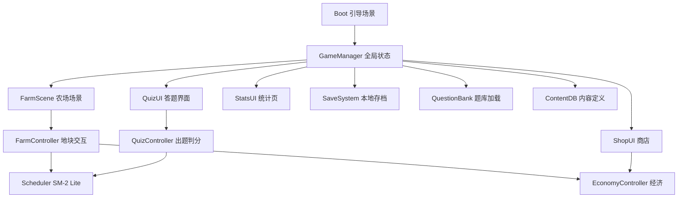

# 学田 (Study Farm) 技术设计

Feature Name: study-farm
Updated: 2026-09-13
需求文档: 同目录 requirements.md

## Description

Unity C# 开发的 2D 像素风农场学习游戏，Android APK 交付，纯离线单机。本题库由仓库内 4 份考研 PDF 转换为结构化 JSON，随包分发。核心循环：播种知识点 → 答题浇水 → 间隔复习 → 收获果实 → 扩建农场。

## 技术选型与理由

| 项 | 选择 | 理由 |
|---|---|---|
| 引擎 | Unity 6000.x LTS | 用户指定；Android 导出成熟；C# 生态 |
| 脚本 | C# + JsonUtility（复杂结构用 Newtonsoft） | 官方 JSON 方案，题库/存档序列化 |
| 渲染 | URP 2D | 像素风标准管线 |
| 分辨率 | 竖屏 1080×1920 逻辑分辨率，Canvas Scaler 适配 | 单手答题体验 |
| minSdk / 目标 | 24 (Android 7.0) / ARM64 + IL2CPP | 覆盖 95%+ 设备 |
| 题库转换脚本 | Node.js（仓库 tools/ 下，与 PDF 解析库生态匹配） | 可在容器内跑通全流程 |

## Architecture



- **GameManager**：全局单例，持有游戏状态机（启动/农场/答题/商店），驱动自动存档。
- **FarmController**：地块渲染、点击路由、作物状态视觉（正常/需浇水/蔫萎/可收获）。
- **QuizController**：按知识点抽题、判分、错题记录、连击暴击判定，输出答题结果事件。
- **Scheduler**：SM-2 Lite 核心算法，输入答题结果，输出新间隔与 next_due。
- **EconomyController**：果实/种子/道具余额、商店交易、掉落表掷骰。
- **SaveSystem**：JSON 存档 + 滚动备份（保留 3 份）+ 导出/导入。
- **QuestionBank**：启动时加载 StreamingAssets JSON，建 知识点→题目列表 索引。
- **ContentDB**：作物定义、道具定义、掉落表，以 ScriptableObject + JSON 双轨（JSON 为准便于热调整）。

## Components and Interfaces

```csharp
// 核心接口（v1 草案）
interface IScheduler {
    ReviewPlan OnAnswer(string kpId, bool correct);   // 返回新间隔/next_due
    List<string> GetDueKnowledgePoints();             // 今日到期列表
}

interface IQuestionBank {
    Question DrawQuestion(string kpId);               // 随机抽题（排除近5次已用）
    KnowledgePointMeta GetMeta(string kpId);          // 科目/章节/摘要
}

interface ISaveSystem {
    void Save(GameSave state);                        // 触发滚动备份
    GameSave Load();
    string Export();                                  // 返回可分享文件路径
    bool Import(string path);
}
```

## Data Models

### 题库 JSON（StreamingAssets/questionbank/{subject}.json）

```json
{
  "subject": "math",
  "subject_name": "高等数学",
  "version": 1,
  "chapters": [
    {
      "id": "math.ch07",
      "name": "第七章 微分方程",
      "knowledge_points": [
        {
          "id": "math.ch07.kp01",
          "name": "一阶线性微分方程",
          "summary": "通解公式：y = e^(-∫P dx) ( ∫Q e^(∫P dx) dx + C )",
          "crop_rarity": "rare"
        }
      ]
    }
  ],
  "questions": [
    {
      "id": "math.q0001",
      "kp_id": "math.ch07.kp01",
      "type": "single",
      "stem": "...",
      "options": ["A...", "B...", "C...", "D..."],
      "answer": 2,
      "explanation": "...",
      "difficulty": 2,
      "source": "750题 P123 #15"
    }
  ]
}
```

type 枚举：single / multi / judge / blank。difficulty 1-3。

### 存档 JSON（persistentDataPath/save.json）

```json
{
  "schema_version": 1,
  "farmer": { "level": 3, "exp": 120, "fruit": 350, "streak": 5, "last_active_day": "2026-09-13" },
  "inventory": { "seeds": {"math.ch07.kp01": 2}, "items": {"fertilizer": 1, "rescue": 1} },
  "plots": [
    { "zone": "math", "index": 0, "kp_id": "math.ch07.kp01", "growth": 2,
      "state": "growing", "next_due": "2026-09-15", "interval_days": 3 }
  ],
  "unlocked_zones": ["math"],
  "review_log": { "math.ch07.kp01": { "correct": 6, "wrong": 1, "last_result": true } },
  "wrong_book": ["math.q0102", "math.q0087"],
  "collection": ["math.ch01.kp03"]
}
```

## SM-2 Lite 算法

```
答对: interval = interval == 0 ? 1 : interval == 1 ? 3 : round(interval * ease)
      ease 初始 2.2，答对 +0.05（上限 2.8），答错重置 ease=2.2
答错: interval = 1, growth 不变（不倒退，防挫败）
作物上限: growth == 5 → 可收获
蔫萎: next_due 超时 24h → state=withered（化肥立即恢复并刷新 next_due）
```

## 题库转换管线（tools/ 目录，Node.js）

1. `tools/pdf-extract.mjs`：PDF → 章节结构文本（高数 750 题按题目编号切分；两本环工教材按目录章节切分）。
2. `tools/build-questionbank.mjs`：文本 → 题目 JSON 草稿（题干/选项/答案/解析/知识点挂接）。
3. `tools/validate-questionbank.mjs`：校验 ID 唯一、kp_id 引用完整、答案索引合法、字段完备，输出统计报告。
4. 产出物提交到 `game/Assets/StreamingAssets/questionbank/`。
5. 质量关卡：转换后人工抽查每科 ≥20 题；解析缺失题目标记 `needs_review`，v1 可带但答题后不展示解析。

说明：环工教材为知识点摘要整理（喂给 R2.3 的播种卡片），题目形态以"概念辨析单选 + 判断"为主，750 题为完整题源。

## APK 构建管线（容器内自动）

1. 容器安装 Unity 6000.x LTS Linux 编辑器 + Android Build Support（含 JDK/SDK/NDK 模块）。
2. 授权：用户提供 Unity 账号 → CLI `-username -password -serial` 激活个人版；失败则走手动激活文件流程（脚本输出指引，见 R11.3）。
3. `game/build.sh`：`unity-editor -batchmode -nographics -quit -executeMethod BuildScript.BuildAndroid` → 产出 `build/StudyFarm-{version}-arm64.apk`。
4. 工程内 `Assets/Editor/BuildScript.cs`：读版本号、切 Android 平台、IL2CPP/ARM64、执行 Build。
5. 风险预案：容器构建失败 → 降级为用户本地构建（交付工程 + build.sh 同款文档）。

## 美术管线

1. 主体：免费像素素材包（农场 tileset、UI 9-slice、角色 4 向行走图）。
2. AI 生图补充：作物各生长阶段图标、稀有装饰、Logo。用户后续提供生图 key。
3. key 管理：写入 `game/.env`（已 gitignore），模板进 `game/.env.example`，生图脚本 `tools/gen-art.mjs` 读取环境变量，key 与产物分离。
4. 生图 prompt 统一模板（保持风格一致）：像素风、16×16/32×32 逻辑分辨率、限定调色板、透明背景。

## 目录结构

```
study/
├── game/                      # Unity 工程（Assets/ProjectSettings/Packages）
│   ├── Assets/
│   │   ├── Scenes/  Scripts/  Prefabs/  Art/  StreamingAssets/questionbank/
│   │   └── Editor/BuildScript.cs
│   ├── build.sh
│   ├── .env.example
│   └── .gitignore             # Library/ Temp/ Logs/ build/ .env
├── tools/                     # 题库转换 + 生图脚本（Node.js）
├── .monkeycode/specs/study-farm/   # 本规划书
└── *.pdf                      # 原始资料
```

## Correctness Properties

1. 任一 knowledge_point 至少挂接 1 道题；孤立知识点在 validate 脚本报错。
2. 存档 schema_version 升级必须提供迁移函数；导入低版本档先迁移再覆盖。
3. Scheduler 输出的 next_due 恒大于当前时间；interval 恒 ≥ 1。
4. 经济操作（购买/掉落）前后果实总量守恒（有来源或有去向）。
5. 每日自然日切换（本地时区）必须触发 streak 判定，时区变更以设备时间为准。

## Error Handling

| 场景 | 处理 |
|---|---|
| 题库 JSON 损坏 | 跳过该文件，UI 列出失败文件与原因，其余科目可用 |
| 存档写入失败 | 保留旧档 + 内存态继续运行，下次行为重试写盘 |
| 答题中途退出/杀进程 | 行为粒度保存（每题提交即落盘） |
| 构建授权失败 | 输出激活阶段标识 + 手动激活文件路径与操作指引 |

## Test Strategy

1. **EditMode 单测**（Unity Test Framework）：Scheduler 间隔序列、经济守恒、存档 roundtrip（Save→Load 相等）、错题重置逻辑。
2. **题库校验**：validate 脚本进 CI（构建前强制跑），任何校验失败阻断打包。
3. **真机冒烟清单**：安装启动、播种→答题→收获全流程、杀进程恢复、存档导出→导入、streak 跨日判定（改设备时间验证）。
4. **构建冒烟**：APK 体积基线（目标 < 150 MB）、启动时间 < 5s（中端机）。

## References

- 需求来源: 同目录 requirements.md
- 原始资料: 仓库根目录 4 份 PDF
- Unity Android 构建文档: https://docs.unity3d.com/Manual/android-BuildProcess.html
- SM-2 算法: https://supermemo.guru/wiki/SuperMemo-1.4
