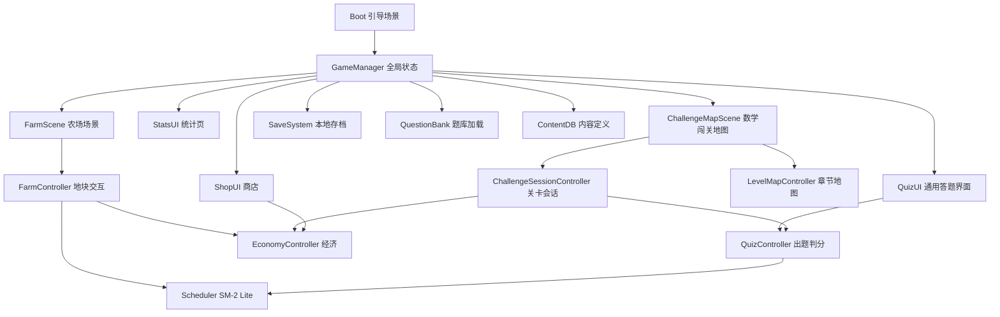

# 学田 (Study Farm) 技术设计

Feature Name: study-farm
Updated: 2026-09-13 (rev2)
需求文档: 同目录 requirements.md

## Description

Unity C# 开发的 2D 像素风农场学习游戏，Android APK 交付，纯离线单机。双玩法支柱：

- **知识农场**：环工原理/环工学知识点 → 播种 → 答题浇水 → SM-2 Lite 间隔复习 → 收获。
- **数学闯关**：750 题按章节组织为关卡地图，折叠答案交互，星级结算，奖励反哺农场经济。

全部知识点与题目携带出处（书名/章节/页码/题号）。美术由 AI 并行生成（80+ 资产，tools/art-manifest.json）。

## 技术选型与理由

| 项 | 选择 | 理由 |
|---|---|---|
| 引擎 | Unity 6000.x LTS | 用户指定；Android 导出成熟；C# 生态 |
| 脚本 | C# + Newtonsoft JSON | 题库/存档序列化，schema 灵活 |
| 渲染 | URP 2D | 像素风标准管线 |
| 分辨率 | 竖屏 1080×1920 逻辑分辨率，Canvas Scaler 适配 | 单手答题体验 |
| minSdk / 目标 | 24 (Android 7.0) / ARM64 + IL2CPP | 覆盖 95%+ 设备 |
| 题库转换脚本 | Node.js（tools/ 下） | 容器内跑通全流程 |
| 生图管线 | tools/gen-art.mjs 并行生成，manifest 驱动 | 已验证，见"美术管线"节 |

## Architecture



- **QuizController**：农场与闯关共用的答题核心。负责抽题、判分、答案展开状态机（折叠/自动展开/主动展开）、错题记录、连击判定。农场模式输出 ReviewResult，闯关模式输出 ChallengeAnswer。
- **ChallengeSessionController**：一关的会话状态（题目序列、逐题结果、退出即作废）。
- **LevelMapController**：章节地图渲染（节点/星级/boss 锁定态）、进入关卡路由。
- **FarmController / Scheduler / EconomyController / SaveSystem / QuestionBank / ContentDB**：同 rev1 职责。

### 答案折叠状态机（QuizController 内）

```
[state] SHOWING_QUESTION
  ├─ 玩家点"展开答案" → MANUAL_REVEALED（该题标记判负）→ 玩家可继续作答或跳过
  ├─ 玩家提交作答 → JUDGED（自动展开答案+解析+出处）→ 下一题
MANUAL_REVEALED
  ├─ 玩家提交作答 → 判定仍执行，但该题强制记 wrong（防作弊）
JUDGED
  ├─ 点"下一题" → 下一题或结算
```

## Components and Interfaces

```csharp
// 核心接口（v1 草案）
interface IScheduler {
    ReviewPlan OnAnswer(string kpId, bool correct);
    List<string> GetDueKnowledgePoints();
}

interface IQuestionBank {
    Question DrawQuestion(string kpId);                 // 农场抽题（排除近5次已用）
    Question GetQuestion(string id);                    // 闯关按 ID 取题
    List<Level> GetLevels(string chapterId);
    KnowledgePointMeta GetMeta(string kpId);            // 含 source
}

interface IChallengeSession {
    void Start(Level level);
    ChallengeAnswer Submit(Question q, int? choice);    // choice=null 表示跳过
    LevelResult Finish();                               // 星级结算
    void Abort();                                       // 退出，整关作废
}

interface ISaveSystem {
    void Save(GameSave state);
    GameSave Load();
    string Export();
    bool Import(string path);
}
```

## Data Models

### 题库 JSON（StreamingAssets/questionbank/{subject}.json）

```json
{
  "subject": "math",
  "subject_name": "高等数学",
  "version": 1,
  "source_book": "高等数学下册精选750题",
  "chapters": [
    {
      "id": "math.ch07",
      "name": "第七章 微分方程",
      "levels": [
        { "id": "math.ch07.lv01", "name": "第1关", "question_ids": ["math.q0061"],
          "pass_rate": 0.5, "star3_rate": 0.9, "star2_rate": 0.7, "is_boss": false,
          "first_clear_reward": { "fruit": 30, "seeds": 2 } }
      ],
      "knowledge_points": [
        {
          "id": "math.ch07.kp01",
          "name": "一阶线性微分方程",
          "summary": "通解公式：y = e^(-∫P dx) ( ∫Q e^(∫P dx) dx + C )",
          "crop_rarity": "rare",
          "source": { "book": "高等数学下册精选750题", "chapter": "第七章", "page": "P118-126" }
        }
      ]
    }
  ],
  "questions": [
    {
      "id": "math.q0001",
      "kp_id": "math.ch07.kp01",
      "type": "single",
      "stem": "...",
      "options": ["A...", "B...", "C...", "D..."],
      "answer": 2,
      "explanation": "...",
      "difficulty": 2,
      "source": { "book": "高等数学下册精选750题", "page": "P123", "no": 15 },
      "answer_source": { "book": "高等数学下册精选750题", "page": "P312", "no": 15 },
      "needs_review": false
    }
  ]
}
```

- `source`：题面出处；`answer_source`：书后答案页出处（750 题答案在书后，需匹配）。
- 环工知识点 source 用教材页码/小节；summary 卡片（播种卡/复习卡）必须渲染出处。
- type 枚举：single / multi / judge / blank。difficulty 1-3。

### 存档 JSON（persistentDataPath/save.json）

rev1 基础上新增：

```json
{
  "schema_version": 2,
  "challenge": {
    "levels": { "math.ch07.lv01": { "stars": 3, "best_rate": 0.95, "cleared": true } },
    "chapter_chests": ["math.ch01"]
  },
  "reveal_log": { "math.q0001": { "count": 2, "last": "2026-09-13" } }
}
```

## SM-2 Lite 算法（不变）

```
答对: interval = interval == 0 ? 1 : interval == 1 ? 3 : round(interval * ease)
      ease 初始 2.2，答对 +0.05（上限 2.8），答错重置 ease=2.2
答错: interval = 1, growth 不变（不倒退，防挫败）
作物上限: growth == 5 → 可收获
蔫萎: next_due 超时 24h → state=withered（化肥立即恢复并刷新 next_due）
```

## 题库转换管线（tools/，Node.js）

1. `tools/pdf-extract.mjs`：PDF → 章节结构文本（750 题按题目编号切分；两本环工教材按目录章节切分）。
2. `tools/build-questionbank.mjs`：
   - 数学：题目文本 → 题目 JSON；**答案匹配步骤**——书后答案区按题号对齐到题面，写入 answer/explanation/answer_source；匹配失败的题标记 needs_review 且默认不进关卡。
   - 环工：教材章节 → 知识点摘要（含出处页码）+ 概念辨析单选/判断题。
3. `tools/validate-questionbank.mjs`：强制校验——ID 唯一、kp_id 引用完整、答案索引合法、**source/answer_source 非空**、关卡 question_ids 引用完整、needs_review 题不入关卡。任何失败阻断构建。
4. 产出物提交到 `game/Assets/StreamingAssets/questionbank/`。
5. 质量关卡：转换后人工抽查每科 ≥20 题（含答案匹配正确性抽检）。

## APK 构建管线（容器内自动，Unity 后续启动）

1. 容器安装 Unity 6000.x LTS Linux 编辑器 + Android Build Support（含 JDK/SDK/NDK 模块）。
2. 授权：用户提供 Unity 账号 → CLI 激活个人版；失败走手动激活文件流程（脚本输出指引）。
3. `game/build.sh`：`unity-editor -batchmode -nographics -quit -executeMethod BuildScript.BuildAndroid` → `build/StudyFarm-{version}-arm64.apk`。
4. 构建前置钩子：自动运行 validate-questionbank.mjs，失败即终止。
5. 风险预案：容器构建失败 → 降级为用户本地构建（交付工程 + 文档）。

## 美术管线（已运行）

1. **生成**：`tools/gen-art.mjs --manifest tools/art-manifest.json --concurrency 4`，OpenAI 兼容端点（agnes-image-2.5-flash），manifest 80 项资产，style_suffix 统一风格（32×32 像素风/限定调色板/星露谷味/纯白底/无文字）。
2. **资产分类**：crops（环工 9 种作物×3 阶段 + 数学奖杯株×2）、ui 图标×18、tiles×6、buildings×12、quiz 特效×6、challenge 节点徽章×6、character×2。
3. **后处理（待做）** `tools/post-art.mjs`：纯白底抠透明（白键色容差）、降采样至 256px、紧凑裁剪。
4. **角色动画**：AI 生图只出立绘（front/back）；四向行走帧采用免费素材包（风格匹配优先 Sprout Lands 类），AI 逐帧生成一致性不达标。
5. **key 管理**：game/.env（gitignore），.env.example 占位。

## 目录结构

```
study/
├── game/
│   ├── Assets/               # Unity 工程（后续创建）：Scenes/Scripts/Prefabs/Art/StreamingAssets
│   ├── art/                  # AI 生图产物（crops/ui/tiles/buildings/quiz/challenge/character）
│   ├── .env / .env.example   # 生图 key（.env 已 gitignore）
│   └── build.sh
├── tools/                    # gen-art.mjs / art-manifest.json / pdf-extract / build-questionbank / validate
├── .monkeycode/specs/study-farm/   # 本规划书
└── *.pdf                     # 原始资料
```

## Correctness Properties

1. 任一 knowledge_point 至少挂接 1 道题；孤立知识点在 validate 报错。
2. 每个知识点与每道题的 source 非空；数学题额外要求 answer 与 answer_source 非空（needs_review 豁免但不得入关卡）。
3. 关卡内 question_ids 数量 == 关卡配置数量（默认 10）；boss 关例外可配置。
4. 存档 schema_version 升级必须提供迁移函数；导入低版本档先迁移再覆盖。
5. Scheduler 输出的 next_due 恒大于当前时间；interval 恒 ≥ 1。
6. 经济操作（购买/掉落/奖励）前后果实总量守恒。
7. 主动展开答案的题，最终判定恒为 wrong，与玩家作答内容无关。
8. 每日自然日切换（本地时区）触发 streak 判定；浇水与闯关答题均计入活跃。

## Error Handling

| 场景 | 处理 |
|---|---|
| 题库 JSON 损坏 | 跳过该文件，UI 列出失败文件与原因，其余科目可用 |
| 答案匹配失败（750题） | 题目标记 needs_review，排除出关卡，可作练习题（答案折叠交互照常，解析标注"待校对"） |
| 存档写入失败 | 保留旧档 + 内存态继续运行，下次行为重试写盘 |
| 答题中途退出/杀进程 | 农场模式行为粒度保存；闯关模式整关作废（需求 R11.8） |
| 构建授权失败 | 输出激活阶段标识 + 手动激活文件路径与操作指引 |

## Test Strategy

1. **EditMode 单测**（Unity Test Framework）：Scheduler 间隔序列、经济守恒、存档 roundtrip、**答案折叠状态机**（主动展开→强制判负）、星级边界（90%/70%/50%）、streak 跨日判定。
2. **题库校验**：validate 脚本为构建前置钩子，失败阻断打包；答案匹配率报告（目标 ≥95% 入关）。
3. **真机冒烟清单**：安装启动、播种→答题→收获全流程、闯关 3 星通关与 boss 解锁、杀进程恢复（农场保留/闯关作废）、存档导出→导入、streak 跨日（改设备时间）。
4. **构建冒烟**：APK 体积基线（目标 < 150 MB）、启动时间 < 5s（中端机）。

## 执行任务清单（To-do，按序执行）

规划书即任务书：以下为全部待执行工作，任何一项开工前先重读本文档。

### T1 美术资产生成（未完成部分）

- 现状：manifest 80 项中 60 项已生成于 `game/art/`，20 项待生成（crops 9、tiles 5、buildings 3、challenge 1、character 2）。
- 执行：`node tools/gen-art.mjs --manifest tools/art-manifest.json --concurrency 4`（幂等，已存在自动跳过），预计 5 分钟。
- 校验：全部 80 项存在且为有效 PNG（magic bytes 89504e4e）。
- 遗留：`game/art/crops.bak/` 为 rev1 首批 8 张备份，T3 完成后可清理。

### T2 美术后处理脚本 `tools/post-art.mjs`（未开始）

- 纯白底抠透明：白键色容差抠图（像素风色块边界清晰，flood-fill 从四角扩散最稳）。
- 降采样至 256×256、透明边紧凑裁剪、输出到 `game/art/final/`（保持子目录结构）。
- 校验：输出 PNG 必须含 alpha 通道，四角像素 alpha==0。

### T3 题库转换管线（未开始）

- `tools/pdf-extract.mjs`：PDF → 章节结构文本。
- `tools/build-questionbank.mjs`：750 题切题 + 书后答案匹配（answer/answer_source）；环工教材 → 知识点摘要（含出处）+ 概念辨析题。
- `tools/validate-questionbank.mjs`：强制校验（见 Correctness Properties），产出匹配率报告（目标 ≥95% 题目入关）。
- 产出物入库：`game/Assets/StreamingAssets/questionbank/`（Unity 工程创建后）。

### T4 Unity 工程创建（未开始，等用户指示启动）

- `game/` 下创建 Unity 6000.x LTS 工程（URP 2D，Android 平台）。
- 目录骨架：Scenes/Scripts/Prefabs/Art/StreamingAssets/Editor。
- 迁移 `game/art/final/` 资产入 Assets，导入免费素材包（角色四向行走帧）。
- 实现 `Assets/Editor/BuildScript.cs` + `game/build.sh`。

### T5 核心系统实现（未开始）

- 按 Architecture 节实现 GameManager/SaveSystem/QuestionBank/Scheduler/EconomyController/QuizController（含答案折叠状态机）/FarmController/ChallengeSessionController/LevelMapController。
- 单测按 Test Strategy 第 1 条落地。

### T6 APK 构建管线（未开始，依赖用户提供 Unity 账号）

- 容器安装 Unity + Android Build Support，CLI 激活个人版授权。
- 跑通 `game/build.sh` 产出 ARM64 APK，执行真机冒烟清单。

## References

- 需求来源: 同目录 requirements.md
- 原始资料: 仓库根目录 4 份 PDF
- 美术清单: tools/art-manifest.json（80 项）
- Unity Android 构建文档: https://docs.unity3d.com/Manual/android-BuildProcess.html
- SM-2 算法: https://supermemo.guru/wiki/SuperMemo-1.4
